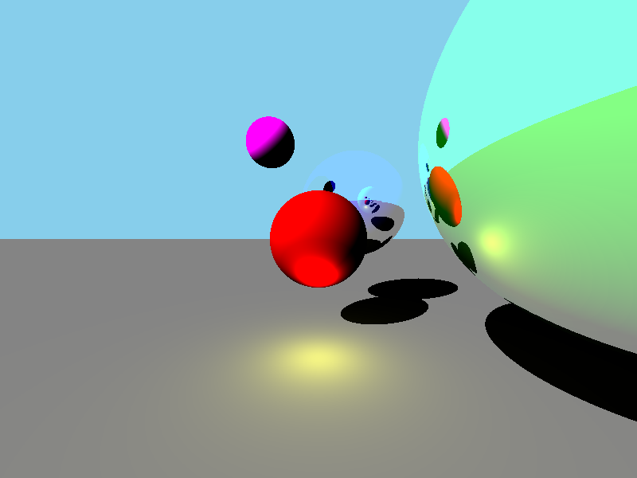

# Rust ray tracer

This project was made with the goal of experimenting the rust programing language and learning how to do a ray tracer.

## What can it do ?

Scenes:
- [x] Scene loading from a json file
- [x] Scene size
- [x] Camera fov

Objects:
- [x] Sphere
- [x] Plane

Lightning:
- [x] Handle multiple lights
- [x] Point lights (like a lamp)
- [x] Directional lights (like the sun)

Materials:
- [x] Diffused color
- [x] Reflection (with adjustable number of reflection depth)

## Planned

Scenes:
- [ ] Movable camera (at the moment it is fixed at (0,0,0) looking in the -z axis)

Objects:
- [ ] Cube
- [ ] Cone
- [ ] Cylinder
- [ ] Triangles
- [ ] Object made of triangle (like .obj files)

Materials:
- [ ] Refraction
- [ ] Textures

## Example
Computed from the [test_scene/scene02.json](./test_scene/scene02.json) test file.



## How to run

You need the rust programing environment (rustc, cargo...) to be installed.
See [rustup](https://rustup.rs/) if the rust programing environment is not already installed.

To run simply use:
```shell script
cargo run
```
This will build and run the program.

Use `cargo run -- --help` to see what is available.

### Build for release

To build the release version use:
```shell script
cargo build --release
```
This will build the program in `target/release/rust_raytracer`.

## Resources used

[Official rust tutorial](https://doc.rust-lang.org/book/ch00-00-introduction.html): used to learn how to program in rust

[Scratchapixel ray tracing tutorial](https://www.scratchapixel.com/lessons/3d-basic-rendering/introduction-to-ray-tracing/how-does-it-work): used to create a ray tracer

[Scratchapixel 3d rendering tutorial](https://www.scratchapixel.com/lessons/3d-basic-rendering/ray-tracing-generating-camera-rays/generating-camera-rays): used to generate camera rays

[Scratchapixel shading tutorial](https://www.scratchapixel.com/lessons/3d-basic-rendering/introduction-to-shading/shading-spherical-light): used to compute lightning and reflection

## Author

[Julian Frabel](https://github.com/Eldriann)